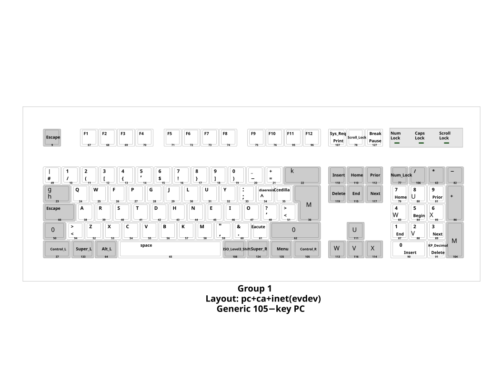

J'utilise Arch Linux en passant

---

# dev setup;

| Directoire   | Informations                              |
| :----------: | :---------------------------------------- |
| env          | dotfiles                                  |
| cmds         | commandes pour installer certaines choses |
| resources    | quelques ressources dont j'ai besoin      |
| scripts      | scripts utiles                            |
| root         | choses configurées en root                |

### Wallpapers
can be found [here](https://github.com/fuyu147/wallpapers)

### keyboard layout

